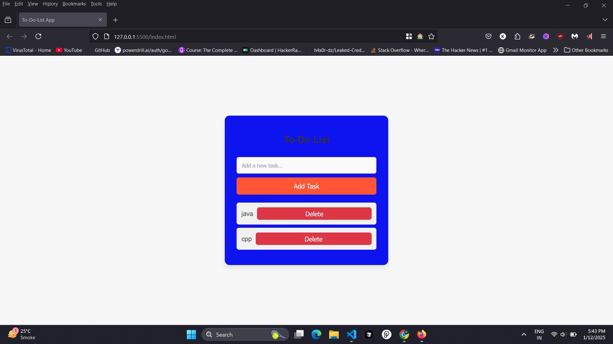

# To-Do List App

# Todo List App

## :sparkles: Features

- Add tasks to the list
- Remove tasks from the list
- Tasks are stored in local storage

## :computer: Tech Stack

- JavaScript
- HTML
- CSS

## :art: Screenshot

## :book: How to run

1. Clone the repository
2. Open `index.html` in your browser

## :heart: Contributing

Contributions are welcome! Please open a pull request to contribute.

## :copyright: Licence

This project is licensed under the MIT License. See the [LICENSE](https://github.com/KunjShah95/todo-list-app/blob/master/LICENSE) file for details.

## :handshake: Acknowledgments

This project was built using the following resources:

- [Pure CSS To-Do List](https://codepen.io/rachelandrew/pen/RRqJxP)
- [Standard JS](https://standardjs.com/)
